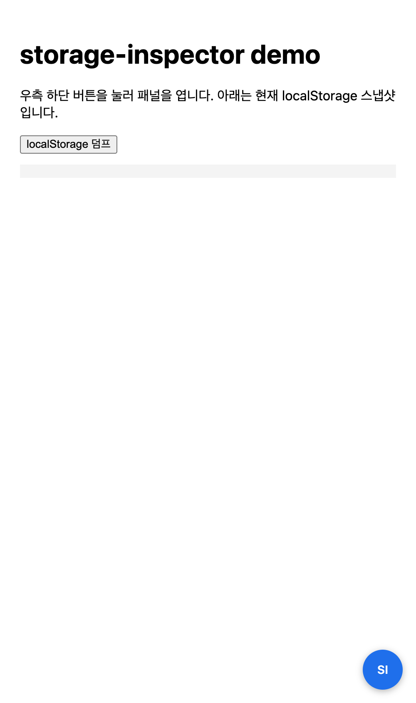
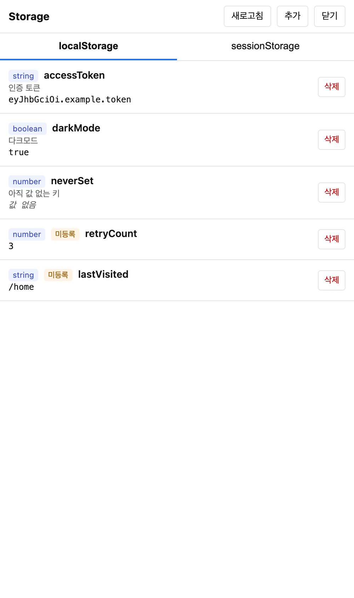
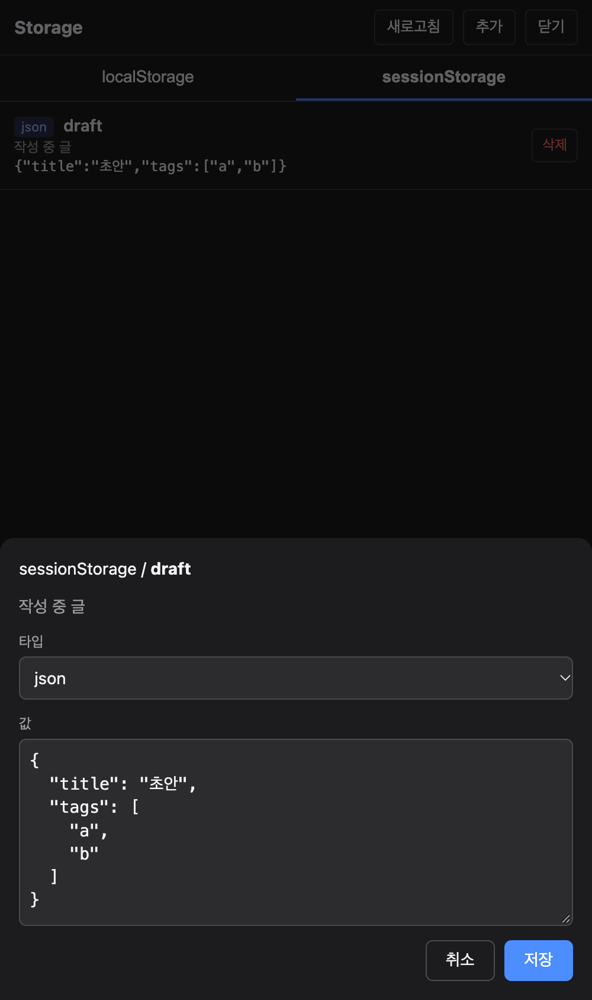

# storage-inspector

웹뷰 안에서 localStorage 와 sessionStorage 를 조회, 편집, 추가, 삭제하는 디버깅 도구입니다. 스크립트 한 줄로 우측 하단에 버튼이 뜨고, 누르면 전체 화면 패널이 열립니다. vConsole 의 Storage 패널과 비슷하지만, 개발자가 키/설명/타입 스키마를 등록해 두면 그 기준으로 보여주고, 스키마에 없는 키도 현재 저장된 값 기준으로 함께 표시합니다.

Lit 웹 컴포넌트로 만들었고 Shadow DOM 을 써서 호스트 앱의 CSS 와 서로 간섭하지 않습니다. 런타임 의존성은 번들에 포함된 Lit 하나뿐이라 사용하는 쪽에서 따로 설치할 것이 없습니다 (IIFE 기준 gzip 약 10KB).

**데모**: https://yceffort.github.io/storage-inspector/demo/ (빌드된 IIFE 를 스크립트 태그로 넣은 정적 페이지) / **Storybook**: https://yceffort.github.io/storage-inspector/

## 화면

| 런처 | 목록 (라이트) | 편집 시트 (다크) |
|---|---|---|
|  |  |  |

- 목록에는 타입 뱃지, 설명, 값 미리보기가 한 줄로 보입니다. 스키마에 없는 키는 "미등록" 뱃지가 붙고, 스키마에 있지만 값이 없는 키는 "값 없음" 으로 표시됩니다.
- 항목을 누르면 하단 시트가 올라옵니다. 타입 드롭다운(string, number, boolean, json)에 따라 입력기가 바뀌고, JSON 파싱 실패나 숫자 오류가 있으면 저장 버튼이 잠깁니다.
- 삭제는 확인 없이 즉시 실행되고, 상단의 추가 버튼으로 새 키를 넣을 수 있습니다.

## 설치

```bash
pnpm add @yceffort/storage-inspector
```

## 사용

```ts
import { init } from '@yceffort/storage-inspector'

const inspector = init({
  schema: [
    { key: 'accessToken', description: '인증 토큰', type: 'string', storage: 'local' },
    { key: 'darkMode', description: '다크모드', type: 'boolean', storage: 'local' },
    { key: 'draft', description: '작성 중 글', type: 'json', storage: 'session' },
  ],
})

inspector.open()
inspector.close()
inspector.destroy()
```

스크립트 태그로 쓸 때는 IIFE 빌드를 넣고 전역 `StorageInspector` 를 호출합니다. `<head>` 에 넣어도 body 가 생긴 뒤 마운트되므로 위치는 상관없습니다.

```html
<script src="https://unpkg.com/@yceffort/storage-inspector/dist/storage-inspector.iife.js"></script>
<script>
  StorageInspector.init({ schema: [/* ... */] })
</script>
```

### 옵션

| 옵션 | 타입 | 기본값 | 설명 |
|---|---|---|---|
| `schema` | `SchemaEntry[]` | `[]` | 미리 등록할 키 목록. 아래 스키마 표 참고 |
| `theme` | `'light' \| 'dark'` | 시스템 설정 | 지정하면 `prefers-color-scheme` 보다 우선 |
| `bottomOffset` | `number` (px) | `0` | 런처, 시트, 목록 하단 여백을 이만큼 위로 밀어 네이티브 탭바에 가리지 않게 함. `env(safe-area-inset-bottom)` 은 항상 더해짐 |
| `zIndex` | `number` | `2147483000` | 런처의 z-index. 패널은 +1, 시트는 +2 |

```ts
init({ schema, theme: 'dark', bottomOffset: 56, zIndex: 1000 })
```

### 스키마

| 필드 | 필수 | 설명 |
|---|---|---|
| `key` | 예 | 저장소 키 |
| `storage` | 예 | `'local'` 또는 `'session'` |
| `description` | 아니오 | 목록과 시트에 표시되는 설명 |
| `type` | 아니오 | `'string' \| 'number' \| 'boolean' \| 'json'`. 없으면 값을 보고 추론 |
| `options` | 아니오 | string 타입에서 허용하는 값 목록. 주면 입력기가 드롭다운으로 바뀌고 목록 밖의 값은 저장이 막힘 |
| `validate` | 아니오 | 저장 전에 파싱된 값을 검사하는 [Standard Schema](https://standardschema.dev) 객체. zod, valibot, arktype 스키마를 그대로 넘기면 됨 |

타입 추론 규칙: `"true"`/`"false"` 는 boolean, 유한한 숫자로 읽히면 number, 객체나 배열 JSON 이면 json, 나머지는 string 입니다.

### TypeScript 타입과 연결하기

`type: 'json'` 은 "JSON 으로 파싱된다" 까지만 보장합니다. 값의 실제 형태를 강제하려면 `validate` 에 Standard Schema 를 넘기십시오. 시트가 저장 직전에 파싱된 값을 검증기로 넘기고, 실패하면 경로와 메시지를 보여주며 저장 버튼을 잠급니다. 리터럴 유니온은 `options` 로 드롭다운을 만듭니다.

```ts
import { z } from 'zod'

const Draft = z.object({ title: z.string().min(1), tags: z.array(z.string()) })
type Draft = z.infer<typeof Draft> // 앱 코드에서 같은 타입을 공유

init({
  schema: [
    { key: 'draft', storage: 'session', type: 'json', validate: Draft },
    { key: 'theme', storage: 'local', options: ['light', 'dark', 'system'] satisfies Theme[] },
  ],
})
```

검증기는 도구가 직접 의존하지 않고 `~standard` 인터페이스만 호출하므로 번들 크기에 영향이 없습니다. 비동기 검증기도 지원합니다.

## 동작

- 패널을 열 때와 새로고침 버튼을 누를 때 저장소를 읽습니다. 앱이 값을 바꿔도 자동 갱신은 하지 않습니다.
- 저장소에는 항상 문자열을 씁니다. number 는 정규화된 숫자 문자열, boolean 은 `"true"`/`"false"`, json 은 공백 없이 직렬화한 문자열입니다.
- 시트에서 바꾼 타입은 패널이 살아 있는 동안만 기억합니다. 저장소에 도구 전용 키를 만들지 않습니다.
- 스키마에 등록된 키는 삭제해도 목록에 "값 없음" 으로 남습니다. 미등록 키는 목록에서 사라집니다.
- HttpOnly 쿠키처럼 JS 에서 접근할 수 없는 값은 다루지 않습니다. 쿠키 자체가 범위 밖입니다.

## 테마

- 색상은 전부 `--si-*` CSS 커스텀 프로퍼티로 정의되어 있고 `<storage-inspector>` 루트에서만 값을 줍니다. 하위 컴포넌트는 상속받아 씁니다.
- 기본은 시스템의 `prefers-color-scheme` 을 따르고, 루트의 `theme` 속성(`light` / `dark`)이 있으면 그것이 우선합니다. `color-scheme` 도 함께 바뀌어 select, checkbox 같은 네이티브 컨트롤도 테마에 맞춰집니다.
- Storybook 툴바의 Theme 토글로 라이트/다크를 바로 비교할 수 있습니다.

## 개발

```bash
pnpm install
pnpm exec playwright install chromium   # 처음 한 번, Storybook 테스트와 E2E 가 사용
pnpm dev              # 데모 페이지
pnpm storybook        # Storybook (localhost:6006)
pnpm test             # 코어 단위 테스트 (Vitest)
pnpm test:storybook   # 스토리 상호작용 테스트 (Vitest 브라우저 모드, headless Chromium)
pnpm test:e2e         # Playwright E2E (데모 페이지와 IIFE head 삽입 페이지)
pnpm test:all         # 위 세 가지 전부
pnpm typecheck
pnpm build
```

빌드는 Vite 8 라이브러리 모드로 ESM(`dist/storage-inspector.js`) 과 IIFE(`dist/storage-inspector.iife.js`) 를 만들고, 타입 선언은 vite-plugin-dts 가 `dist/index.d.ts` 로 냅니다.

테스트 구성:

- `src/core/*.test.ts`: 목록 병합, 타입 추론, 변환, 쓰기의 순수 로직.
- `src/components/*.stories.ts`: 컴포넌트마다 스토리와 `play` 함수. 이벤트 발생, 검증 메시지, 저장 버튼 상태를 검사하고 `StorageInspector/FullFlow` 는 실제 localStorage 를 대상으로 열기, 편집, 타입 유지, 삭제, 추가를 한 번에 훑습니다.
- `e2e/*.spec.ts`: Vite dev 서버 위의 데모 페이지와 IIFE 번들을 `<head>` 에 넣은 페이지를 Playwright 로 검증합니다.

CI 는 GitHub Actions 에서 main 푸시와 PR 마다 typecheck, 단위 테스트, Storybook 테스트, 빌드, E2E 를 순서대로 돌립니다.

## 라이선스

MIT
